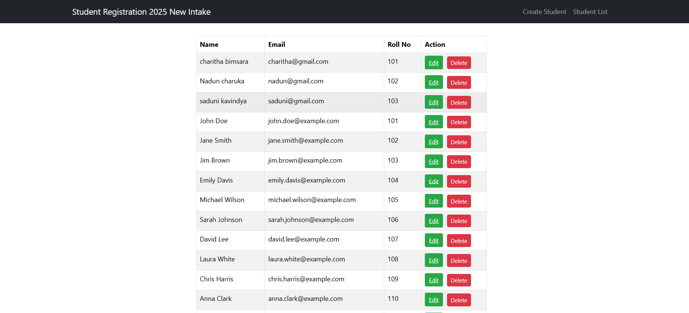

# Student Registration System MERN

A simple web application to **Create**, **Read**, **Update**, and **Delete** (CRUD) student records using **ReactJS (Frontend)** and **Node.js + Express + MongoDB (Backend)**.

## 🚀 Features

- Add a new student
- View all students
- Update existing student details
- Delete student with confirmation

## 📷 Demo

## 🛠️ Tech Stack

- Frontend: React, React Router, Bootstrap, Formik, Yup
- Backend: Express.js, MongoDB, Mongoose
- Axios for HTTP requests
